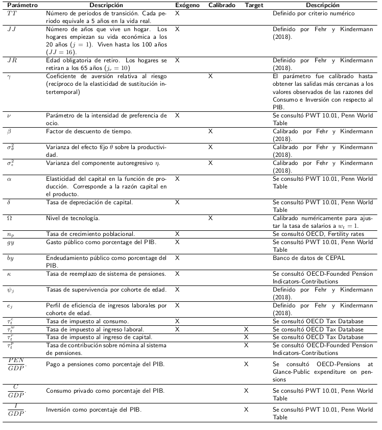
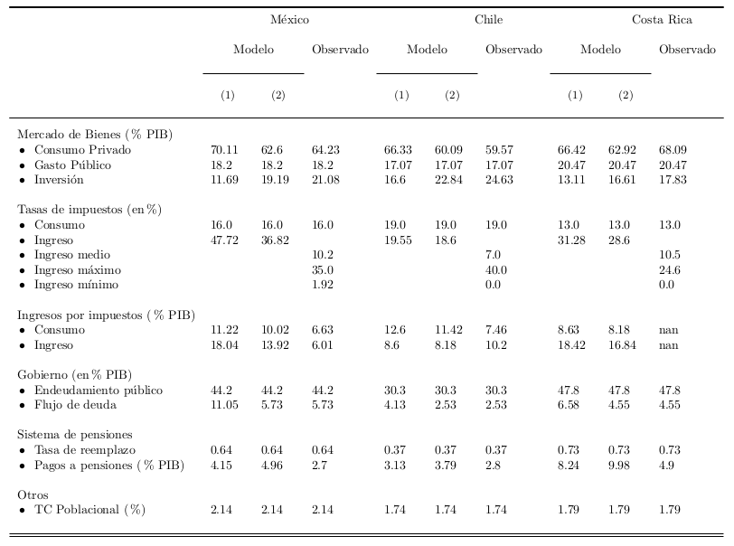

# Modelo de Generaciones Traslapadas Dinámico y Estocástico

 Modelo de Generaciones Traslapadas Dinámico y Estocástico realizado para el BID bajo el proyecto “A general equilibrium model for a new social contract: health, pensions, and care”

Este modelo incorpora a riesgos idiosincráticos en la productividad laboral y decisión endógena de la oferta de laboral de los hogares. El precio de los factores responde a cambios en el comportamiento individual y el gobierno entra como un agente que recolecta ingresos por impuestos para financiar su gasto. El modelo se basa en el modelo presentado por [Fehr y Kindermann (2018)](https://global.oup.com/academic/product/introduction-to-computational-economics-using-fortran-9780198804390?q=Economics%20Using%20Fortran&lang=en&cc=mx).


## Demografía
En cada periodo $t$, la economía está poblada por $J$ generaciones traslapadas indizadas por $j = 1, \dots, J$. Se asume que la supervivencia de un periodo al siguiente es estocástica y que $\psi_j$ es la probabilidad que un agente sobreviva de la edad $j-1$ a la edad $j$, condicional a que vive en la edad $j-1$. La probabilidad incondicional de sobrevivir a la edad $j$ está dada por $\Pi_{i=1}^j \psi_i$ con $\psi_1=1$. Dado que el número de miembros de cada cohorte declina con respecto a la edad, el tamaño del cohorte correspondiente a la edad $j$ en el periodo $t$ es

$$
\begin{equation}
  N_{j,t} =  \psi_{j,t}N_{j-1, t-1} \quad \text{con} \quad N_{1,t} = (1+n_{p,t})N_{1,t-1}
\end{equation}
$$

En consecuencia, los pesos de los cohortes (las razones relativas de población) se definen como $m_{1,t}=1$ y $m_{j,t} = \dfrac{\psi_{j,t}}{1+n_{p,t}}m_{j-1,t-1}$.


La trayectoria de crecimiento balanceado, es decir donde todas las variables agregadas crecen a una misma tasa, se fija a la tasa de crecimiento del cohorte más joven, el cual se mantiene constante en todos los periodos $n_{p,t}=n_p$. Se normalizan dichas variables agregadas al tiempo $t$ por el tamaño del cohorte más joven que está viviendo en ese periodo.

## Decisiones de los hogares: preferencias y riesgo en la productividad laboral

Los individuos tienen preferencias sobre consumo $c_{j,t}$ y ocio $\mathrm{l}_{j,t}$, además que pagan impuestos sobre el consumo e ingresos así como también un impuesto sobre nómina al sistema de pensiones. Se asume que la asignación de tiempo es igual a 1. Con $l_{j,t}$ denotando la cantidad de trabajo en horas ofrecido a mercado en el periodo $t$, tenemos $\mathrm{l}_{j,t}+l_{j,t} = 1$. La función de utilidad de los hogares se define como  

$$
\begin{equation}
  E\Bigg[ \sum_{j=1}^J\beta^{j-1} \Big(\Pi_{i=1}^j \psi_{i,k} \Big)u(c_{j,s}, 1-l_{j,s}) \Bigg]
\end{equation}
$$

donde $\beta$ denota el factor de descuento de tiempo.

Dado que no hay mercados de rentas vitalicias (annuity markets), el retorno a activos individuales corresponde a la tasa de interés neta. En un marco donde no hay riesgo de longevidad los agentes conocen con certeza en qué momento su vida terminará. Por lo tanto, son capaces de planear perfectamente en qué punto del tiempo quieren consumir todos sus ahorros. En el modelo que aquí se presenta hay incertidumbre de supervivencia, los agentes pueden morir antes que la máxima duración de vida $J$ y, como consecuencia, dejar una herencia. Denotemos $b_{j,t}$ como la herencia que un agente en la edad $j$ recive en el periodo $t$.

La pregunta que surge es cuánto del total de activos (incluyendo intereses sobre los pagos) de los agentes fallecidos se distribuye en los miembros de los cohortes sobrevivientes. Se define el siguiente esquema de distribución flexible

$$
\Gamma_{j,s} = \dfrac{\omega_{b,j}}{\sum_{i=1}^J\omega_{b,i}m_{i,s}}
$$

donde $\omega_{b,j}$ se especifica exógenamente.

La cantidad de herencia para cada cohorte puede ser calculado mediante la expresión:
$$
\begin{equation}
  b_{j,t} = \Gamma_{j,t}BQ_{t}
\end{equation}
$$

donde $BQ_{t}$ define la herencia agregada en el periodo $t$, o simplemente la fracción del total de activos que pueden ser atribuidos a quienes fallecieron al final del período anterior (incluidos los intereses).

$$
\begin{equation}
  BQ_t = R_t^n \sum_{j=2}^J a_{j,t} \dfrac{m_{j,t}}{\psi_{j,t}} (1-\psi_{j,t})
\end{equation}
$$

El financiamiento al presupuesto del sistema de pensiones pay-as-you-go es igual a:

$$
\begin{equation}
  \tau_t^p w_t L_t = pen_t \times m_{J,t}
\end{equation}
$$


La función de utilidad de los hogares está dada por

$$
\begin{equation}
u(c_{j,t}, 1-l_{j,t}) = \dfrac{[(c_{j,t})^\nu (1-l_{j,t})^{(1-\nu)} ]^{(1 - \frac{1}{\gamma})}}{1 - \frac{1}{\gamma}}
\end{equation}
$$

La utilidad de consumo y ocio toma la forma de una función Cobb-Douglas con un parámetro $\nu$ de preferencia entre ocio y consumo. La elasticidad de sustitución intertemporal es constante e igual a $\gamma$, donde $\dfrac{1}{\gamma}$ es la aversión al riesgo del hogar.

Los individuos difieren respecto a su productividad laboral $h_{j,t}$, la cual depende de un perfil (determinístico) de ingresos por edad $e_j$, un efecto de productividad fijo $\theta$ que es definido al comienzo del ciclo de vida, y de un componente autoregresivo $\eta_{j,t}$ que evoluciona en el tiempo y que tiene una estructura autoregresiva de orden 1, de manera que

$$
\begin{equation}
  \eta_j = \rho \eta_{j-1} + \epsilon_j \quad \text{con} \quad \epsilon_j \sim N(0, \sigma_{\epsilon}^2) \quad \text{y} \quad \eta_1=0
\end{equation}
$$

Dada esta estructura, la productividad laboral del hogar es

$$
h_j=\begin{cases}
  e_j \exp{\big[\theta+\eta_j\big]} & \text{si }j<j_r\\
  0 & \text{si }j \geq j_r.
\end{cases}
$$

A la edad obligatoria de retiro $j_r$, la productividad laboral cae a cero y lo hogares reciben una pensión $pen_{j,t}$ igual a la fracción $\kappa$ (tasa de reemplazo del sistema de pensiones, definida de forma exógena) del ingreso laboral promedio en el periodo $t$.  

$$
pen_j=\begin{cases}
  0  & \text{si }j<j_r\\
  \kappa_t \dfrac{w_t}{j_r-1} \sum_{j=1}^{j_r-1}e_j, & \text{si }j \geq j_r.
\end{cases}
$$


Los hogares maximizan la función de utilidad sujeta a la restricción presupuestaria intertemporal

$$
\begin{equation}
  a_{j+1,s} = (1+r_t^n)a_{j,s} + w_t^nh_{j,s}l_{j,s} + b_{j,s} + pen_{j,s} - p_tc_{j,s}
\end{equation}
$$

donde:
* $a_{j,t}$ son los ahorros-activos del agente en el periodo t,
* $w_t^n = w_t(1-\tau_t^w-\tau_t^p)$ es la tasa de salario neto, la cual es igual al salario de mercado $w_t$ menos los impuestos por ingreso laboral $\tau_t^w$ y el impuesto de nómina para financiar el sistema de pensión $\tau_t^p$,
* $r_t^n = r_t(1-\tau_t^r)$ es la tasa de interés neta, que es igual a la tasa de interés de mercado $r_t$ descontando el impuesto por ingresos de capital $\tau_t^r$,
* $p_t = 1+\tau_t^c$ es el precio al consumidor el cual se normaliza a uno y se agregan los impuestos al consumo $\tau_t^c$.

Se agrega una restricción adicional de no negatividad de los ahorros $a_{j+1,s} \geq 0$


### El problema de programación dinámica
El problema de optimización de los agentes es el siguiente:

$$
\begin{equation}
\begin{aligned}
V_t(z) = \max_{c,l,a^+} \quad & u(c,1-l) + \beta E\Big[ V_{t+1}(z^+)|\eta\Big]\\
\textrm{s.a.} \quad & a^+ + p_t c = (1+r_t^n)a + w_t^nhl + pen, \quad a^+\geq 0,\quad l \geq 0 \\
  & \text{y} \quad \eta^+ = \rho \eta + \epsilon^+ \quad \text{con} \quad \epsilon^+ \sim N(0.\sigma_{\epsilon}^2),     \\
\end{aligned}
\end{equation}
$$

donde $z = (j, a, \theta, \eta)$ es el vector de variables de estado individuales. Nótese que se colocó un índice de tiempo en la función de valor y en los precios. Esto es necesario para calcular la dinámica de la transición entre dos estados estacionarios. La condición terminal de la función de valor es

$$
\begin{equation}
  V_t(z) = 0 \quad \text{para} \quad z = (J+1,a,\theta,\eta),
\end{equation}
$$

que significa que se asume que los agentes no valoran lo que sucede después de la muerte.

Formulamos la solución de problema de los hogares al reconocer que podemos escribir las funciones de horas laborales y de consumo como funciones de $a^+$ :

$$
\begin{equation}
l = l(a^\texttt{+})=\min \lbrace\max [ \nu + \dfrac{1-\nu}{w_t^n h} (a^\texttt{+} - (1+r_t^n)a -pen),0 ], 1  \rbrace
\end{equation}
$$

$$
\begin{equation}
c = c(a^\texttt{+}) = \dfrac{1}{p_t} [  (1+r_t^n)a + w_t^nhl(a^\texttt{+}) + pen -a^\texttt{+} ]
\end{equation}
$$

El problema de los hogares se reduce a resolver la condición de primer orden

$$
\begin{equation}
\dfrac{\nu[ c(a^\texttt{+})^\nu (1-l(a^\texttt{+}))^{1-\nu} ]^{1-\frac{1}{\gamma}}}{p_tc(a^\texttt{+})}=\beta(1+r_{t+1}^n)\times E [ \dfrac{\nu [ c_{t+1}(z^\texttt{+})^\nu (1-l_{t+1}(z^\texttt{+}))^{1-\nu} ]^{1 - \frac{1}{\gamma}}}{p_{t+1}c_{t+1}(z^\texttt{+})} | \eta ]
\end{equation}
$$

donde $a^\texttt{+}$ es desconocido.

## Agregación

Con el objetivo de agregar las decisiones individuales para cada elemento del espacio de estados a las cantidades agregadas de la economía, necesitamos determinar la distribución de los hogares $\phi_t(z)$ en el espacio de estados. Se asume que, de alguna manera, hemos discretizado el espacio de estados. Podemos aplicar el procedimiento descrito en el capítulo 10 de [Fehr y Kindermann (2018)](https://global.oup.com/academic/product/introduction-to-computational-economics-using-fortran-9780198804390?q=Economics%20Using%20Fortran&lang=en&cc=mx). Sabemos que a la edad $j=1$ los hogares mantienen cero activos, y que experimentan shock de productividad permanente $\hat{\theta}_i$ con probabilidad $\pi_i^\theta$, como también un shock transitorio en la productividad de $\eta_1=0$. De manera que tenemos:
$$
\phi_t(1,0,\hat{\theta}_i,\hat{\eta}_g)=\begin{cases}
  \pi_i^\theta & \text{si } g=\dfrac{m+1}{2} \quad \text{ y } \\
  0 & \text{en otro caso}.
\end{cases}
$$

Conociendo la distribución de los hogares sobre el espacio de estados a la edad 1 podemos calcular la distribución de cualquier combinación sucesiva edad-año al utilizar la función de política $a_t^\texttt{+}(z)$. Específicamente, para cada elemento del espacio de estados $z$ a la edad $j$ y tiempo $t$, podemos calcular los nodos de interpolación izquierdo y derecho, $\hat{a}_l$ y $\hat{a}_r$, como también el correspondiente peso de interpolación $\varphi$. Los nodos y el peso satisfacen

$$
\begin{equation}
  a_t^\texttt{+}(z) = \varphi \hat{a}_l + (1-\varphi)\hat{a}_r
\end{equation}
$$

Tomando en cuenta las probabilidades de transición para el shock de productividad transitorio $\eta_{gg^{\texttt{+}}}$, se distribuye la masa de individuos en el estado $z$ al espacio de estados correspondiente a la edad y periodo siguientes $j+1$  y $t+1$ de acuerdo a la siguiente expresión:

$$
\phi_{t+1}(z^\texttt{+})=\begin{cases}
   \phi_{t+1}(z^\texttt{+}) + \varphi \pi_{gg^\texttt{+}} \phi_{t}(z) & \text{si } \quad \nu = l \\
  \phi_{t+1}(z^\texttt{+}) + (1-\varphi) \pi_{gg^\texttt{+}} \phi_{t}(z) & \text{si }\quad \nu=r.
\end{cases}
$$

con $z^\texttt{+} = (j+1, \hat{a}_\nu, \hat{\theta}_i, \hat{\eta}_{g^{\texttt{+}}})$

La medida de distribución $\phi_t(z)$ satisface

$$
\begin{equation}
  \sum_{\nu=0}^n \sum_{i=1}^2 \sum_{g=1}^m \phi_t(z) = 1
\end{equation}
$$

para cualquier edad $j$ al tiempo $t$. De manera que podemos calcular agregados específicos a cada cohorte

$$
\begin{equation}
  \bar{c}_{j,t} = \sum_{\nu=0}^n \sum_{i=1}^2 \sum_{g=1}^m \phi_t(z) c_t(z)
\end{equation}
$$
$$
\begin{equation}
  \bar{l}_{j,t} = \sum_{\nu=0}^n \sum_{i=1}^2 \sum_{g=1}^m \phi_t(z) h_t(z)l_t(z)
\end{equation}
$$
$$
\begin{equation}
  \bar{a}_{j,t} = \sum_{\nu=0}^n \sum_{i=1}^2 \sum_{g=1}^m \phi_t(z) \hat{a}_\nu
\end{equation}
$$

Para cada una de esas agregaciones a nivel de cohorte, podemos calcular las cantidades para el conjunto de la economía. Para esto, tenemos que ponderar las variables de cada cohorte con el respectivo tamaño relativo de cada cohorte $m_j$ y su probabilidad de supervivencia $\psi_j$. En consecuencia, tenemos

$$
\begin{equation}
  C_t = \sum_{j=1}^J \dfrac{m_{j,t}}{\psi_{j,t}} \bar{c}_{j,t}
\end{equation}
$$

$$
\begin{equation}
  L_t^s = \sum_{j=1}^J \dfrac{m_{j,t}}{\psi_{j,t}} \bar{l}_{j,t}
\end{equation}
$$

$$
\begin{equation}
  A_t = \sum_{j=1}^J \dfrac{m_{j,t}}{\psi_{j,t}} \bar{a}_{j,t}
\end{equation}
$$

## Empresas
Las empresas contratan capital $K_t$ y trabajo $L_t$ en un mercado de factores perfectamente competitivo para producir un único bien $Y_t$ de acuerdo a una tecnología de producción dada por una función de producción Cobb-Douglas

$$
\begin{equation}
  Y_t = \Omega K_t^\alpha L_t^{1-\alpha}
\end{equation}
$$

donde $\Omega$ es el nivel de tecnología que es constante en el tiempo. El capital se deprecia a una tasa $\delta$, de manera que el stock de capital evoluciona de acuerdo a la siguiente expresión

$$
\begin{equation}
  (1+n_p)K_{t+1} = (1-\delta)K_t + I_t
\end{equation}
$$

Bajo el supuesto de competencia perfecta, las funciones inversas a la demanda de capital y trabajo de la empresa están dadas por

$$
\begin{equation}
  r_t = \alpha \Omega [ \dfrac{L_t}{K_t}]^{(1-\alpha)} - \delta
\end{equation}
$$

$$
\begin{equation}
  w_t = (1-\alpha) \Omega[ \dfrac{K_t}{L_t}]^\alpha
\end{equation}
$$

## Gobierno
El gobierno administra dos sistemas : un sistema de impuestos y un sistema de pensiones, ambos operando en equilibrio presupuestario.

El gobierno recolecta impuestos sobre el el gasto en consumo, ingreso laboral e ingreso de capital con el objetivo de financiar su gasto público $G_t$ y pagos relacionados al stock de deuda $B_t$. En el equilibrio inicial, el gasto público es igual a una razón constante del GDP, esto es, $G = g_y Y$. En periodos posteriores, el nivel de bienes públicos se mantiene constante (per cápita), lo que significa que $G_t=G$. Lo mismo aplica para la deuda pública, donde la razón inicial es denominada $b_y$. En cualquier punto en el tiempo el presupuesto del sistema de impuestos es balanceado si se cumple la igualdad

$$
\begin{equation}
  \tau_t^c C_t + \tau_t^w w_t L_t^s + \tau_t^r r_t A_t + (1+n_p)B_{t+1}=G_t + (1+r_t)B_t
\end{equation}
$$

Además de los ingresos por impuestos, el gobierno financia su gasto al contratar nueva deuda $(1+n_p)B_{t+1}$. Sin embargo, debe repagar la actual deuda incluyendo intereses sobre los pagos de manera que tenemos que agregar  $(1+r_t)B_t$ al consumo de gobierno en el lado del gasto. De manera que, en un equilibrio de estado estacionario, el gasto $(r-n_p)B$ refleja el costo necesitado para mantener el nivel de deuda constante. Nótese que no se ha hecho ninguna restricción a priori acerca de que tasa de impuesto tiene que ajustarse con el objetivo de balancear el presupuesto en el tiempo.

El sistema de pensiones opera en un esquema pay-as-you-go, lo que significa que recolecta contribuciones de las generaciones en edad de trabajar y directamente las distribuye a los retirados actuales. La ecuación de balance del presupuesto del sistema de pensiones está dada por

$$
\begin{equation}
  \tau_t^p w_t L_t^s = \overline{pen}_t N^R \quad \text{con} \quad N^R = \sum_{j = j_r}^J m_j \psi_j
\end{equation}
$$

donde $N^R $ denota la cantidad de retirados. Dado que los pagos son hechos a todos los retirados en una forma *lump-sum*, simplemente se tiene que sumar el tamaño relativo del cohorte de la generación retirada en el lado del gasto y multiplicarlo por esa cantidad con el beneficio respectivo.

Para la evolución de los pagos a pensiones en el tiempo se asume que están vinculados a las ganancias laborales promedio del periodo previo, es decir

$$
\begin{equation}
  \overline{pen}_t = \kappa_t \dfrac{w_{t-1}L_{t-1}^s}{N^L} \quad \text{con} \quad N^L = \sum_{j=1}^{j_r-1}m_j\psi_j
\end{equation}
$$

donde $\kappa_t$ es la tasa de reemplazo del sistema de pensiones y $N^L$ es el tamaño (fijo) de los cohortes en edad de trabajar. Se asume que la tasa de reemplazo $\kappa_t$ está dada de forma exógena mientras que la tasa de contribución $\tau_t^p$ se ajusta con el objetivo de balancear el presupuesto.

## Mercados

Hay tres mercados en la economía : mercado de capital, mercado de trabajo y el mercado de bienes. Con respecto a los mercados de factores, el precio del capital $r_t$ y del trabajo $w_t$ se ajustan para limpiar el mercado, esto es:

$$
\begin{equation}
  K_t + B_t = A \quad \text{y} \quad L_t = L_t^s
\end{equation}
$$

Nótese que hay dos sectores que demandan ahorro de los hogares. El sector de empresas emplea ahorro como capital en el proceso de producción, mientras que el gobierno lo usa como deuda pública con el objetivo de financiar su gasto. El gobierno y las empresas compiten en competencia perfecta en el mercado de capital.

Con respecto al mercado de bienes, todos los productos producidos deben ser utilizados ya sea como consumo por parte del sector privado o por el gobierno, o en forma de inversión en el futuro stock de capital. Así, el equilibrio en el mercado de bienes está dado por

$$
\begin{equation}
  Y_t = C_t + G_t + I_t
\end{equation}
$$

# Parametrización y calibración del modelo

El modelo contempla dos tipos de parámetros: aquellos que pueden ser directamente observados en los datos y aquellos que puedes ser estimados de forma indirecta. En el primer grupo de parámetros tenemos variables como las probabilidades de supervivencia y las razones de capital. En el segundo grupo de variables se encuentran aquellas que son estimadas mediante algún procedimiento de calibración. El procedimiento de calibración usualmente consiste en ajustar el valor de los parámetros hasta que una o varias salidas del modelo sean lo suficientemente cercanas a su valor registrado en el mundo real.

## Parámetros exógenos

Cada periodo del modelo corresponde a 5 años en la vida real. Se supone que los hogares inician su vida económica a la edad de 20 años ($j=1$) y enfrentan una esperanza de vida de 100 años, de manera que el ciclo de vida en el modelo cubre $JJ=16$ periodos. Se define la edad obligatoria de retiro a los 65 años de edad, lo que significa en el modelo que la edad de retiro corresponde a $JR=10$, de manera que los hogares gastan los últimos 7 periodos como retirados del mercado de trabajo y reciben una pensión.

Dado que estamos considerando que un periodo corresponde a 5 años, algunas tasas anuales deben ser convertidas. Pensando el caso de la tasa de crecimiento de la población, suponiendo una tasa de crecimiento anual de 1 por ciento, la conversión a una tasa compuesta a 5 años sería igual a $n_p=1.01^5-1 \sim 0.05$.

La razón de capital en el producto es obtenida de directamente de los datos. Se utilizó la información de [PWT 10.01, Penn World Table](https://www.rug.nl/ggdc/productivity/pwt/?lang=en) para el dato de Chile, Costa Rica y México. De este recurso también se obtuvo la razón de ingreso laboral en el producto. El perfil de productividad dada la edad se toma la sugerida por [Fehr y Kindermann (2018)](https://global.oup.com/academic/product/introduction-to-computational-economics-using-fortran-9780198804390?q=Economics%20Using%20Fortran&lang=en&cc=mx), y fue obtenida de la literatura.

El gasto público total como fracción del GDP es obtenido de [PWT 10.01, Penn World Table](https://www.rug.nl/ggdc/productivity/pwt/?lang=en), mientras que la razón deuda pública-GDP fue obtenido de banco de datos de [CEPAL](https://statistics.cepal.org/portal/cepalstat/dashboard.html?theme=2&lang=es).

Para la calibración de los modelos para los tres países, consideramos 2015 como el año base, de manera que todos los parámetros exógenos corresponden a este año.

## Parámetros calibrados

Los parámetros a calibrar correspondientes a la producción fueron el nivel de tecnología $\Omega$ y la tasa de depreciación $\delta$. A sugerencia de los autores, se normaliza la tasa de salarios igual a uno, $w=1$. El parámetro $\Omega$ fue calibrado numéricamente hasta obtener los valores más cercanos de la tasa de salarios a la unidad. Por su parte, la tasa de depreciación no fue necesario calibrar pues en  [PWT 10.01, Penn World Table](https://www.rug.nl/ggdc/productivity/pwt/?lang=en) se presenta la tasa para los tres países.

El parámetro $\nu$ representa el trade off de las preferencias individuales con respecto al consumo y al ocio. Entre más grande el valor de $\nu$, es más atractivo para los hogares consumir bienes y servicios que son pagados en el mercado que consumir tiempo de ocio. El parámetro $\nu$, por tanto, tiene una influencia importante en la cantidad de horas que un hogar trabaja en el mercado. Se ajusta $\nu$ a un objetivo de una razón promedio de tiempo de trabajo en el total de tiempo asignado que representa aproximadamente 33 por ciento. Este valor se calcula para cada país al asumir una asignación máxima de tiempo de trabajo semanal de 110 horas, asi como también 50 semanas laborales por semana. Entonces se relaciona este promedio anual de horas trabajadas por trabajador, el cual está disponible en la  [PWT 10.01, Penn World Table](https://www.rug.nl/ggdc/productivity/pwt/?lang=en) para los países de estudio.

Los siguientes parámetros a calibrar corresponden al proceso de formación y varianza del logaritmo de los ingresos salariales a lo largo del ciclo de vida de los hogares. Estudios empíricos señalan que alrededor de los 25 años la varianza de los ingresos es de 0.3 y que tiende a incrementarse casi linealmente a un valor de 0.9 hasta la edad de 60 años. En modelo presentado aquí, la varianza del logaritmo de las ganancias laborales se determina por dos componentes : mediante procesos exógenos que afectan la productividad laboral de una forma idiosincrática $\theta$ y $\eta_j$, como también por las decisiones individuales acerca de cuántas horas de trabajo se oferta en el mercado. Contamos con información acerca de la estructura del proceso de productividad laboral y cómo este podría influir en la varianza del logaritmo de las ganancias laborales. El logaritmo de las ganancias laborales de un individuo se define como
$$
\begin{equation}
  \log{(w_th_jl_j)} = \log{(w_t)} + \log{(e_j)} + \theta + \eta_j + \log{(l_j)}
\end{equation}
$$

Los primeros dos componentes son determinístico para cada grupo de edad, de manera que su varianza es igual a cero. La varianza del logaritmo de las ganancias laborales a la edad $j$ sería

$$
\begin{equation}
  \text{Var}[{\log{(w_th_jl_j)}}] = \text{Var}[\theta] + \text{Var}[\eta_j] + \text{Var}[\log{(l_j)}] + 2 \text{Cov}[\theta,\log{(l_j)}] + 2 \text{Cov}[\eta,\log{(l_j)}]
\end{equation}
$$

Para la estrategia de calibración propuesta por los autores, los primeros dos componentes de la varianza son los más interesantes, dado que pueden ser escritos de forma explícita. La condición inicial para el proceso transitorio is $\eta_1=0$, lo que implica que $\text{Var}[\eta_1] = 0$. Sabiendo esto,  podemos calcular las varianzas del componente estocástico del logaritmo de la productividad laboral para cada edad potencial j como

$$
\begin{align*}
\text{Var}[\theta] + \text{Var}[\eta_1] &=  \text{Var}[\theta] &= \sigma_\theta^2 \\
\text{Var}[\theta] + \text{Var}[\eta_2] &=  \text{Var}[\theta + \epsilon_2] &= \sigma_\theta^2 + \sigma_\epsilon^2 \\
\text{Var}[\theta] + \text{Var}[\eta_3] &=  \text{Var}[\theta+ \rho\epsilon_2  + \epsilon_3] &= \sigma_\theta^2 + (1+\rho^2)\sigma_\epsilon^2 \\
\text{Var}[\theta] + \text{Var}[\eta_4] &=  \text{Var}[\theta] + \rho^2\epsilon_2  + \rho\epsilon_3 + \epsilon_4 &= \sigma_\theta^2 + (1+\rho^2 + \rho^4)\sigma_\epsilon^2\\
\vdots
\end{align*}
$$

La recursión anterior dice mucho acerca de la varianza del logaritmo de la productividad laboral sobre el ciclo de vida. En primer lugar, dado que el componente inicial transitorio es normalizado a cero, la varianza del logaritmo de la productividad laboral a la edad más joven $j=1$ es únicamente debida a variaciones en el efecto fijo $\sigma_\theta^2$. En segundo lugar, una varianza que se incrementa fuertemente durante el ciclo de vida indiva una alta autocorrelación del parámetro $\rho$. Asumiendo que $\rho=0$, la varianza del logaritmo de la productividad laboral cambiaría de la edad $j=1$ a la edad $j=2$ en un factor $\sigma_\theta^2 +\sigma_\epsilon^2$ y permanecería constante para el resto del ciclo de vida. Con una autocorrelación $\rho=1$, la varianza de la productividad laboral a la edad $j$ sería $\sigma_\theta^2 +(j-1)\sigma_\epsilon^2$, esto es, se incrementaría linealmente con la edad. Dado que en este modelo la varianza del logaritmo de las ganancias laborales es influida tanto por la productividad laboral y las horas trabajadas, los autores eligen un valor de $\rho=0.98$, lo cual hace que la varianza del logaritmo de la productividad laboral crezca sustancialmente pero no linealmente.

Habiendo seleccionado un valor de $\rho$, los parámetros restantes del proceso de productividad laboral son las varianza $\sigma_\theta^2$ y $\sigma_\epsilon^2$. Los autores calibran dichos valores teniendo como objetivo obtener una varianza igual a 0.3 en el logaritmo de las ganancias laborales al inicio del ciclo económico de agente a la edad de 25 años ($j=2$) y de 0.9 a la edad de 60 años ($j=9$).

Resta parametrizar el esquema del sistema de impuestos y del sistema de pensiones. El gobierno tiene 4 esquemas tributarios a definir con el objetivo de balancear su presupuesto:

1. Definir exógenamente el valor de $\tau_t^w$ y $\tau_t^r$, calcular el valor de $\tau_t^c$.
2. Definir exógenamente el valor de $\tau_t^c$, calcular el valor de $\tau_t^w$ y $\tau_t^r$
3. Definir exógenamente el valor de $\tau_t^c$ y $\tau_t^r$, calcular el valor de $\tau_t^w$.
4. Definir exógenamente el valor de $\tau_t^c$ y $\tau_t^w$, calcular el valor de $\tau_t^r$.

Para las ejecuciones del modelo se definió el esquema 3, es decir, de forma exógena asignamos un valor de la tasa de impuesto al consumo y el modelo calcula las tasas de impuestos al ingreso laboral y de capital. Los valores de la tasa de impuestos al consumo fueron obtenidas de [OECD Tax Database](https://www.oecd.org/tax/tax-policy/tax-database/).

Con respecto al sistema de pensiones, tenemos que definir la tasa de reemplazo $\kappa$. El valor observado de la tasa de reemplazo para los tres países fue obtenido de [OECD-Founded Pension Indicators-Contributions](https://stats.oecd.org/Index.aspx?DataSetCode=PNNI_NEW).

El valor del factor de descuento intertemporal $\beta$ fue el mismo que el usado por los autores.


# Datos

La siguiente tabla presenta los parámetros del modelo. Se clasifican de acuerdo a parámetros que son obtenidos directamente de los datos (parámetro exógenos) y aquellos que son calibrados. Se describe de forma breve el proceso de calibración. Para más detalle, véase la sección de [Parametrización y calibración del modelo](https://milocortes.github.io/DSOLGLatam.jl/dev/calib/dsolg_calib/).

Se muestra también las salidas del modelo que son definidas como targets de calibración. Para el caso de estos targets así como de los parámetros exógenos, se señala la fuente de consulta de datos que se utilizó en el presente análisis.



# Evaluación de la calibración
La siguiente tabla presenta los resultados de la calibración de modelo para los tres países de estudio. Las columnas (1) y (2) corresponden a un modelo donde no hay riesgo de longevidad, es decir, todos los hogares viven en todos los cohortes de edad, y el segundo al modelo aquí descrito con riesgo de longevidad. La intención de presentarlos es mostrar que el incluir esta carácterística al modelo permite obtener un mejor ajuste con respecto a los valores históricos.

Con respecto al mercado de bienes, se presenta un adecuado ajuste del modelo a los valores observados en los regístros históricos. Como se mencionó anteriormente, el punto de referencia fue el año 2015. Para el caso de México, el consumo privado y la inversión como porcentaje del PIB obtenidos de modelo fue de 62.6% y 19.19% respectivamente, mientras que los valores observados fueron de 64.2 y 21.08%.  Para el caso de Chile  los valores obtenidos por el modelo fueron muy cercanos para el caso del consumo privado (60.09% vs 59.57%), mientras que hay una brecha de 2% para el caso de la inversión (19.19% vs 21.08). Para Costa Rica hay un buen ajuste para el caso de la inversión (16.61% vs 17.38), pero el consumo no presenta un buen desempeño, pues hay una brecha de 5% entre el valor del modelo y el observado.

Cómo se mencionó en la sección de datos, para el caso del ajuste del balance presupuestario de gobierno, se eligió el esquema donde se define la tasa de impuestos al consumo y en el modelo se ajusta endógenamente las tasas de impuestos para los ingresos laborales y de capital. Documentamos sólamente la tasa de impuesto sobre el ingreso laboral, pues el impuesto al capital en los paises de estudio es basicamente 0. La tasa impositiva estimada en el modelo para Mexico, Chile y Costa Rica fue de 36%, 18% y 28%. En la tabla registramos las tasas de impuestos máximas, promedio y mínima cobradas en cada país. Para el caso de México y Costa Rica, las tasas obtenidas en el modelo se asemejan a las tasas máximas cobradas a los mayores ingresos, mientras que en el caso de chile, se encuenta entre la tasa promedio y máxima.

Para el caso del sistema de pensiones, para los tres países, el pago a pensiones como porcentaje del PIB no presentó un ajuste como el que se quería. Para el caso de México, el valor del modelo es de 4.9%, mientras que el registrado en OCDE es de 2.14% del PIB. Para el caso de Chile tenemos un mejor ajuste (3.7% vs 2.8%), pero para Costa Rica el valor es casi el doble al histórico.




>
Para compilar a word, usa la instrucción:
```console
pandoc -o prog11_02.docx -f markdown -t docx prog11_02.md
```
