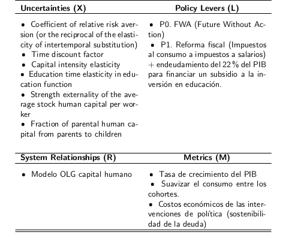

# Modelo OLG Capital Humano

En términos generales, los enfoques de DMDU están compuestos de los siguientes elementos (Marchau, V. A., Walker, W. E., Bloemen, P. J., & Popper, S. W., 2019):

* Acotar el análisis:
    - Formular el problema u oportunidad desencadenante.
    - Especificar la estructura del sistema y sus lı́mites (S).
    - Especificar las metas y objetivos y los indicadores de resultado (O).
    - Especificar las polı́ticas (P).
* Realizar un análisis exploratorio de incertidumbe
    - Especificar las incertidumbres acerca de fuerzas externas (X), estructura del sistema (R), indicadores de resultados (O), y valuación de resultados (W).
    - Explorar los resultados de polı́tica y sus vulnerabilidades (y oportunidades) dadas las incertidumbres (usando modelos u opiniones de expertos)
* Elegir acciones iniciales y acciones contingentes:
    - Seleccionar y planificar la adopción de la polı́tica (inicial) y los mecanismos de ajuste.
    -  Plan de comunicación, seguimiento y de posibles adaptaciones de la polı́tica.
* Iterar y reexaminar

El análisis exploratorio (Exploratory Modeling) de incertidumbre tiene como fin apoyar el proceso de investigación de una amplia gama de supuestos y circunstancias.

En particular, involucra explorar cómo funcionarı́a una alternativa dada (A), en términos de los resultados (O), ante una amplia variedad de estados del mundo (X), estructuras del modelo (R), y valores alternativos del sistema (X).

## Proceso RDM

Los tomadores de decisión también definen las incertidumbres que pueden afectar los vı́nculos entre acciones y consecuencias; y las relaciones, en mayor medida las instancias en las simulaciones por computadora, entre acciones, incertidumbres y objetivos.

Esta información es organizada en una matriz de 2X2 llamada“XLRM” (Lempert et al. 2003), conformada por incertidumbres exógenas (X), polı́ticas (L), relaciones (R), y medidas de desempeño(M).

## Matrix XRLM

